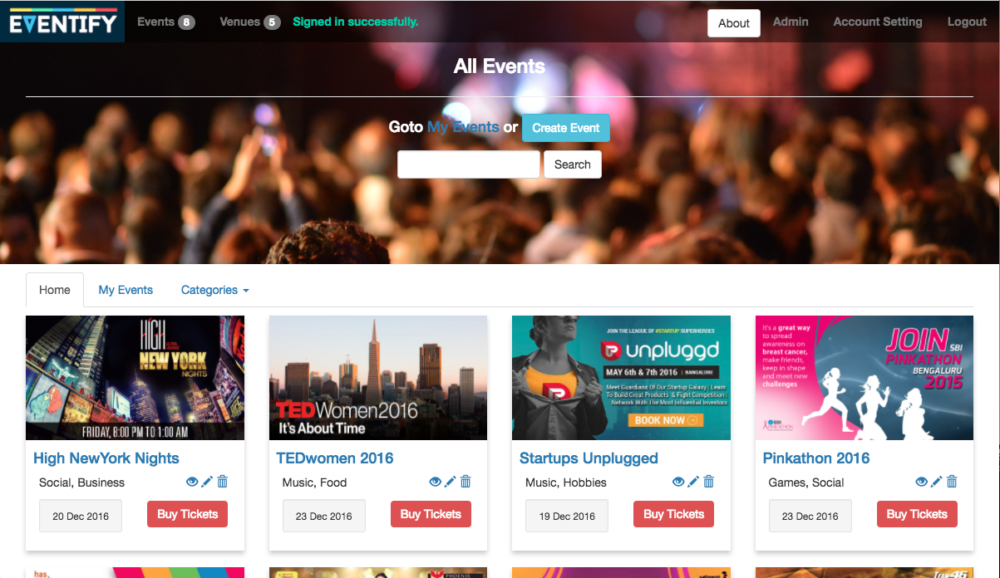

## Eventify
#### [Github](https://github.com/aswinsanakan/eventify) | [Demo](https://eventifyweb.herokuapp.com/)
An event management web application made in Rails 4 from scratch.  
Roles : Event Organiser, Venue Owner and Normal Users.

#### Dependencies used:
- devise gem : For User Authentication 
- cancancan gem : For Role Management 
- carrierwave gem : For image upload
- cloudinary gem : For hosting images
- faker gem : To generate dummy data
- JQuery Full Calendar : To display booked dates for events/venues
- Momentjs : To format date in javascript
- JQuery Chosen : To enhance select boxes
- DateTime Picker : For choosing date and time